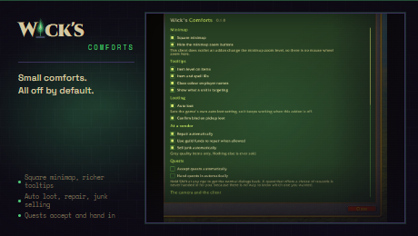

# Wick's Comforts

> Small comforts: square minimap, richer tooltips, auto loot, auto repair and junk selling. Everything off until you turn it on.

Part of the **[Wick suite](https://github.com/Wicksmods/WickSuite)**: precision addons built around a single fel-green-on-deep-purple aesthetic. Built on [WickCore](https://github.com/Wicksmods/WickCore).

## What it is

The handful of conveniences most players end up installing something for.
This is not trying to replace a large tweak suite. It is here for people
who want a few comforts without adopting one, in the same options panel as
the rest of their Wick addons.

**Nothing is on when you install it.** An addon that rearranges your
interface the moment it loads is a rude houseguest, and several Wick
products already require WickCore, so this one never surprises someone who
only wanted bags.

- **Square minimap.** Wearing the suite's own chrome, a thin border and
  fel L-brackets in place of Blizzard's ring, following your theme. The
  quest rings are squared off to match and the zoom buttons can be
  hidden.
- **Tooltips.** Item level on equipment, item and spell IDs, class colour
  on player names, and what a unit is targeting.
- **Auto loot.** Driven through the game's own setting, so it keeps
  working if you disable this addon and never fights Blizzard's checkbox.
  Bind on pickup prompts can be confirmed for you.
- **At a vendor.** Repair on arrival, from guild funds when you are
  allowed and can afford it, and sell grey items. Only poor quality is
  ever sold, and the total is reported in chat so nothing is silent.

## Install

Requires **[WickCore](https://github.com/Wicksmods/WickCore)**. Extract both
folders into your `Interface\AddOns\`.

## Usage

Everything lives under Options, Wick's Mods, Wick's Comforts.

| Command | Effect |
|---|---|
| `/wcomfort` | Open the options |
| `/wcomfort status` | List what you have turned on |

`/wcomforts` is an alias.

## Compatibility

TBC Anniversary 2.5.5 and World of Warcraft: Forever 1.60.x. Requires WickCore.

On Forever the client does not let an addon change the minimap zoom level,
so there is no mouse wheel zoom.

## License

MIT for code (see [LICENSE](LICENSE)). Brand chrome and the "Wick's" wordmark are trademarked, see [TRADEMARK.md](https://github.com/Wicksmods/WickSuite/blob/main/TRADEMARK.md).
